  

  

  

# BIKASH KUMAR YADAV 
 Master of Computer Applications (MCA '24) 
 National Institute of Technology, Tiruchirappalli, India  
[Competitive Programming](#) | [Web Development](#) | [Artificial Intelligence](#) | [Open Source](#)  

<!--
-->

## Technical Skills
* <strong>Programming Languages:</strong> C++, Python, Java, JavaScript
*  <strong>Web Technologies:</strong> HTML/CSS/TypeScript/ React.js /Spring Boot /Node.js /Rest API
* <strong>Database Systems:</strong> SQL, PostgreSQL, MongoDB
* <strong>DevOps and API Tools:</strong> Git, Docker, Postman, RESTful APIs
* <strong>Cloud and Security Tools:</strong> AWS, Bash Scripting
* <strong>Tools & OS:</strong> Microsoft Office, Latex, Mac, Windows, Linux
* <strong>Soft Skills:</strong> Problem-Solving, Agile (Scrum/Kanban), Debugging, Critical Thinking

 ## Relevant Coursework
 <strong>Data Structures and Algorithms</strong>, <strong>Object-Oriented Programming</strong>, <strong>DBMS</strong>, <strong>Operating Systems</strong>, <strong>Computer Networks</strong>, <strong>Cloud Computing</strong>, <strong>Software Engineering Principles</strong>, <strong>Distributed Technology</strong>

## Contribution Graph

## GitHub Activity

  

## GitHub Trophies

<!--

## Pinned

-->

